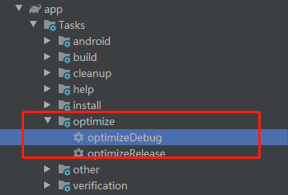

[中文版](README-zh-rCN.md)

# img-optimizer

>A gradle plugin for optimizing PNGs, effectively reducing APK size. Both extreme compression and lossless compression are available.

### Available OS

Tested on `macOS`、`windows10`、`Ubuntu16.04LTS(amd64)`. If you have any questions, plz open issues.

### How to use

Add the following Gradle configuration to your build.gradle: 

```
buildscript {
    repositories {
        maven { url 'https://jitpack.io' }
    }
    dependencies {
        ...
        classpath 'com.github.ByteYuhb:img-oprimizer:v1.0.2'
    }
}
```

Then in your moudle's build.gradle:  

`apply plugin: 'com.xiaoyu.imgoptimizer.plugin'`  

Now you can see the tasks in task tree:  

Double click to execute the task.

### Configuration

You can add the following options to custom the task:   

```
optimizerOptions {
    triggerSize  6
    type  "lossless"
    suffix  ""
    fileFilters = ["mmpic.png","aaa.png"]
}
```

1. `triggerSize` Used for filtering pictures. Picture whose size is less than this option will be ignored. Defaults to 0.
2. `type` Now supports`"lossy"` and `"lossless"`。`"lossy"` means extreme compression(recommend, default, fast, effective)，`"lossless"` means loseless compression(slow, inefficient)。
3. `suffix` The suffix of the picture which has been optimized. If `"_opter"`，the optimizer will generate a new picture `orignal_opter.png` for `original.png`. Defaults to null.
4. `fileFilters`support add whitelist if the file should not be optimizes.

### 效果预览

### Preview

|Original png|Extreme compression(lossy)|Loseless compression(lossless)|
|:---:|:---:|:---:|
|526K|195K(reduce 63%)|473K(reduce 10%)|
||||

### Note

If there are multiple modules in your project, please add the optimizer in where you want to execute optimization since each module is independent. The optimizer will generate log file in the root directory of current module.

### License

[Apache 2.0](http://www.apache.org/licenses/LICENSE-2.0.html)